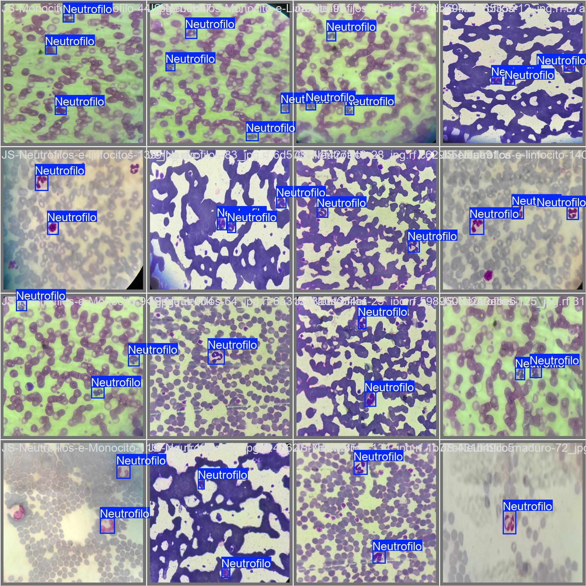
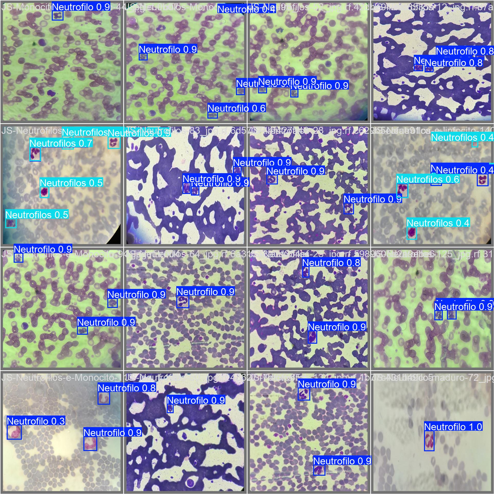
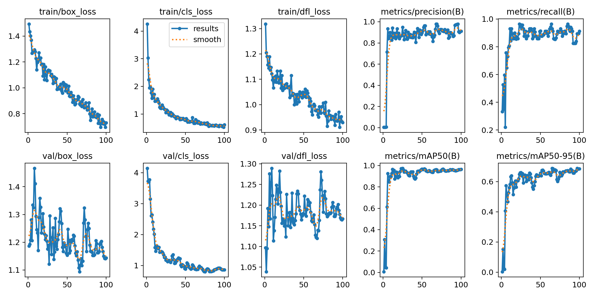
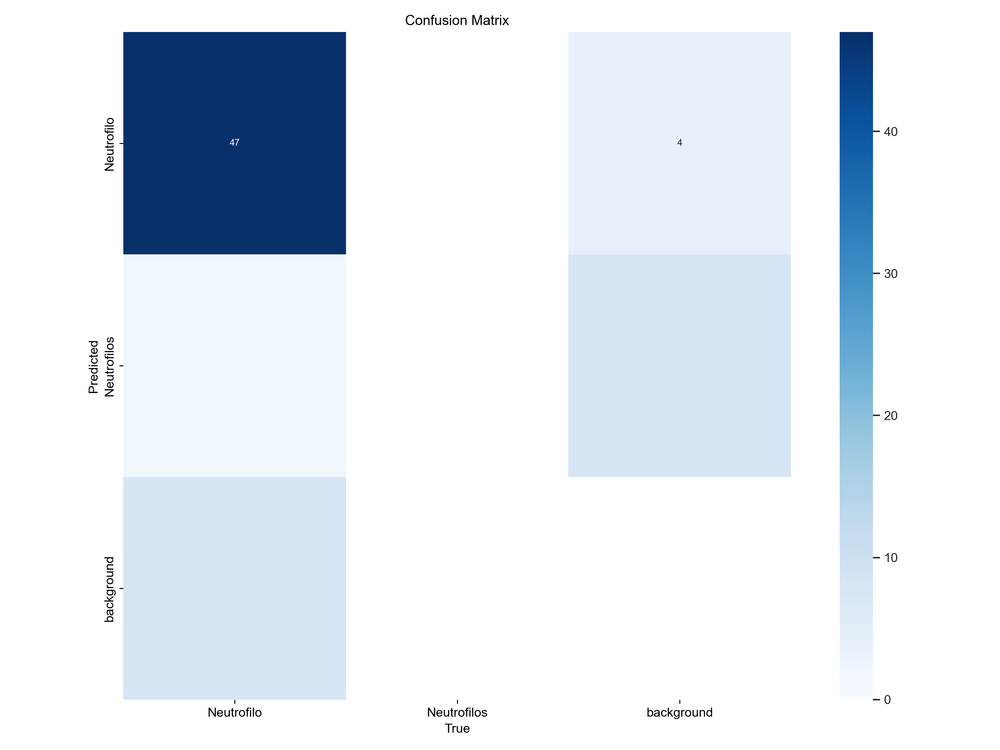
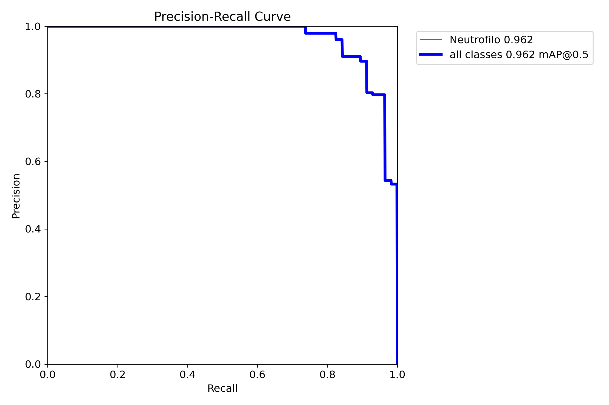
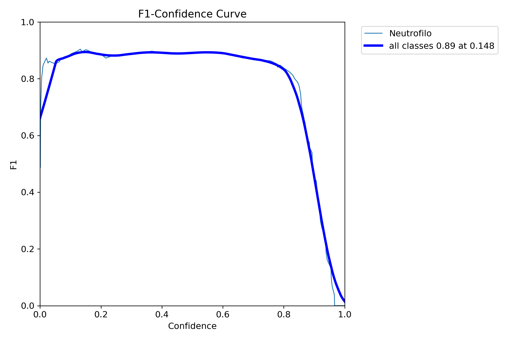

# TechVet — Detecção de Neutrófilos com YOLOv8

Sistema de visão computacional para detecção e contagem automática de **neutrófilos** em imagens microscópicas veterinárias. Modelo YOLOv8 Nano fine-tuned, servido por uma API REST FastAPI com frontend em Streamlit.

> **Status:** prova de conceito acadêmica. As métricas abaixo vêm de um dataset pequeno (142 imagens) e devem ser lidas como demonstração técnica, não como ferramenta de diagnóstico clínico. Veja [Limitações e rigor](#limitações-e-rigor).

---

## Resultado do modelo (exemplo real do conjunto de validação)

| Ground truth (anotação) | Predição do modelo |
|---|---|
|  |  |

As caixas à direita são geradas pelo modelo; à esquerda, as anotações de referência.

---

## Métricas

Valores reais da **última época (100)**, lidos de `runs/detect/train/results.csv`:

| Métrica | Valor | O que significa |
|---|---|---|
| **mAP@50** | **0.965** | Detecção quase perfeita com IoU ≥ 0.5 (a célula está no lugar certo) |
| **mAP@50-95** | **0.685** | Localização sob critério estrito de IoU — mais modesto, como esperado para objetos pequenos e dataset reduzido |
| **Precisão** | 0.912 | Das células marcadas, 91% eram realmente neutrófilos |
| **Recall** | 0.912 | Dos neutrófilos existentes, 91% foram encontrados |
| **F1 Score** | ~0.91 | Média harmônica de precisão e recall |

> Reporto **mAP@50 e mAP@50-95 lado a lado de propósito**: o headline de 0.96 sozinho esconde que a localização sob IoU estrito (0.68) é o limite real do modelo com esse volume de dados. Honestidade > número bonito.

### Evidências de treino

| Curvas de treino (loss + métricas) | Matriz de confusão |
|---|---|
|  |  |

| Curva Precisão-Recall | Curva F1 vs. confiança |
|---|---|
|  |  |

As curvas de loss (treino e validação) caem e estabilizam juntas, sem divergência acentuada entre treino e validação — sinal de que o modelo não está colapsando em overfitting grosseiro apesar do dataset pequeno.

---

## Configuração de treino (reprodutível)

| Parâmetro | Valor |
|---|---|
| Modelo base | YOLOv8n (`yolov8n.pt`, pré-treinado em COCO) |
| Épocas | 100 |
| Batch / Imagem | 8 / 640px |
| Otimizador | auto (lr0 = 0.01) |
| **Seed** | **0** (resultados reprodutíveis) |
| Data augmentation | online — mosaic 1.0, flip horizontal 0.5, scale 0.5, translate 0.1, random erasing 0.4 |

---

## Dataset

- **Fonte:** [Roboflow Universe — techvet v2](https://universe.roboflow.com/hub-nlv7n/techvet/dataset/2) (CC BY 4.0)
- **Total:** 142 imagens — **split honesto declarado:** 99 treino / 29 validação / 14 teste
- **Classes:** `Neutrofilo`, `Neutrofilos`

---

## Limitações e rigor

Sendo transparente sobre o que este projeto **não** é:

1. **Dataset pequeno (142 imgs).** As métricas vêm de um conjunto de teste de 14 imagens — suficiente para demonstrar viabilidade, insuficiente para garantia clínica. Próximo passo natural: mais dados e validação cruzada.
2. **Duas classes redundantes.** O dataset traz `Neutrofilo` e `Neutrofilos` (singular/plural) — provável inconsistência de anotação. Consolidar em uma única classe tende a melhorar a métrica e simplificar o problema.
3. **mAP@50-95 modesto (0.68).** Reflete a dificuldade de localização precisa de objetos pequenos com poucos exemplos. É o número que eu olharia primeiro numa próxima iteração.
4. **Sem teste-time augmentation (TTA)** nem ensemble — inferência simples, priorizando latência.

---

## Arquitetura

```
tecvet2/
├── app.py              # Frontend Streamlit (upload + slider de confiança)
├── main.py             # API REST FastAPI
├── predictor.py        # Lógica de inferência (compartilhada por app e API)
├── data.yaml           # Configuração do dataset YOLO
├── requirements.txt
├── tests/
│   ├── conftest.py
│   ├── test_predictor.py
│   └── test_api.py
└── runs/detect/train/
    ├── weights/best.pt # Pesos do modelo treinado
    ├── results.csv     # Métricas por época
    └── *.png           # Curvas e matriz de confusão
```

---

## Como executar

```bash
pip install -r requirements.txt
```

### Frontend Streamlit (recomendado)

```bash
streamlit run app.py
```

Acesse `http://localhost:8501`, faça upload de uma imagem e ajuste o limiar de confiança na barra lateral.

### API REST (FastAPI)

```bash
uvicorn main:app --reload
```

**Endpoint:** `POST /predict` · **Input:** imagem JPEG/PNG via form-data · **Output:** imagem JPEG com bounding boxes + header `X-Neutrophil-Count`

```bash
curl -X POST http://localhost:8000/predict \
  -F "file=@sua_imagem.jpg" \
  --output resultado.jpg
```

### Testes

```bash
pytest tests/ -v
```

---

## Stack

- **Modelo:** [Ultralytics YOLOv8](https://github.com/ultralytics/ultralytics) · **DL:** PyTorch 2.7
- **API:** FastAPI + Uvicorn · **Frontend:** Streamlit
- **Imagens:** OpenCV + Pillow

---

## Autor

**Diogo Oliveira** — Cientista de Dados
[Portfólio](https://www.datascienceportfol.io/diogohenrique1334) · [GitHub](https://github.com/Diogohenrique1334)